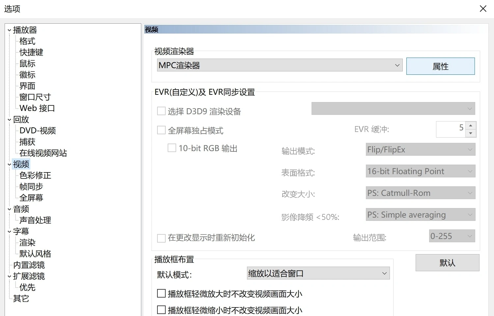
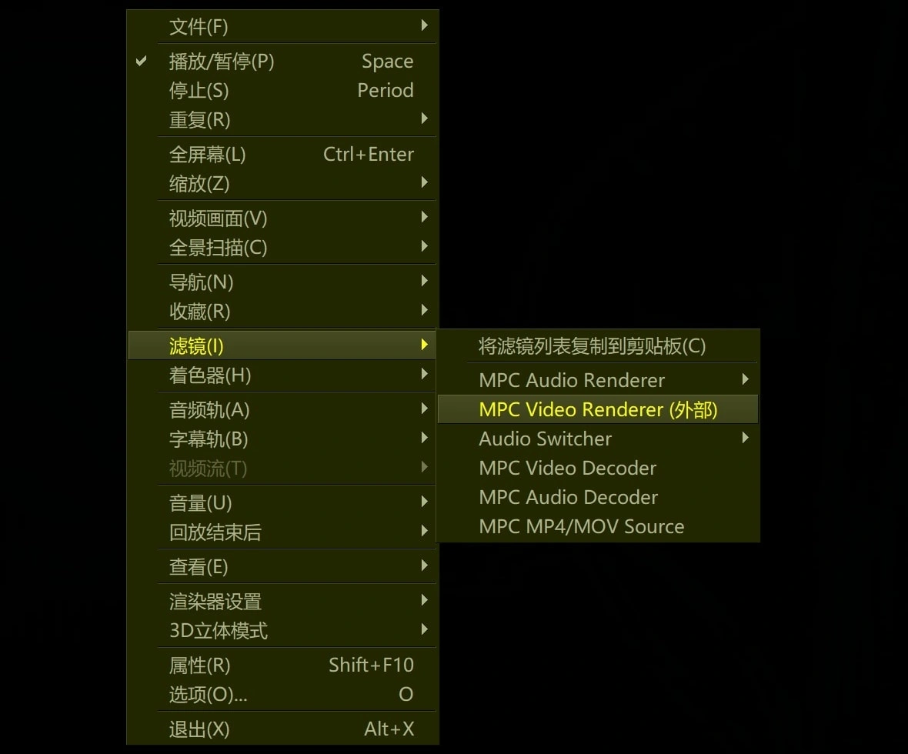
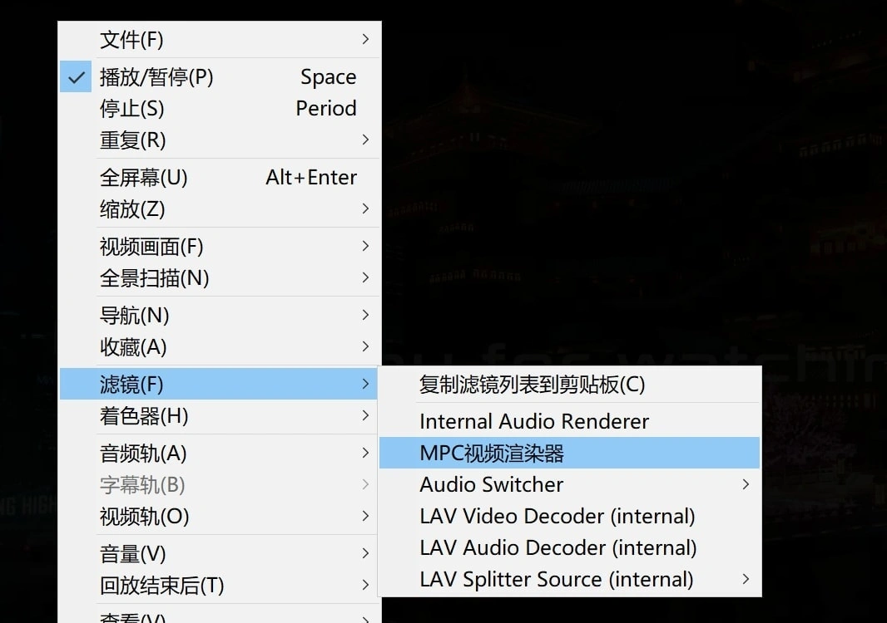
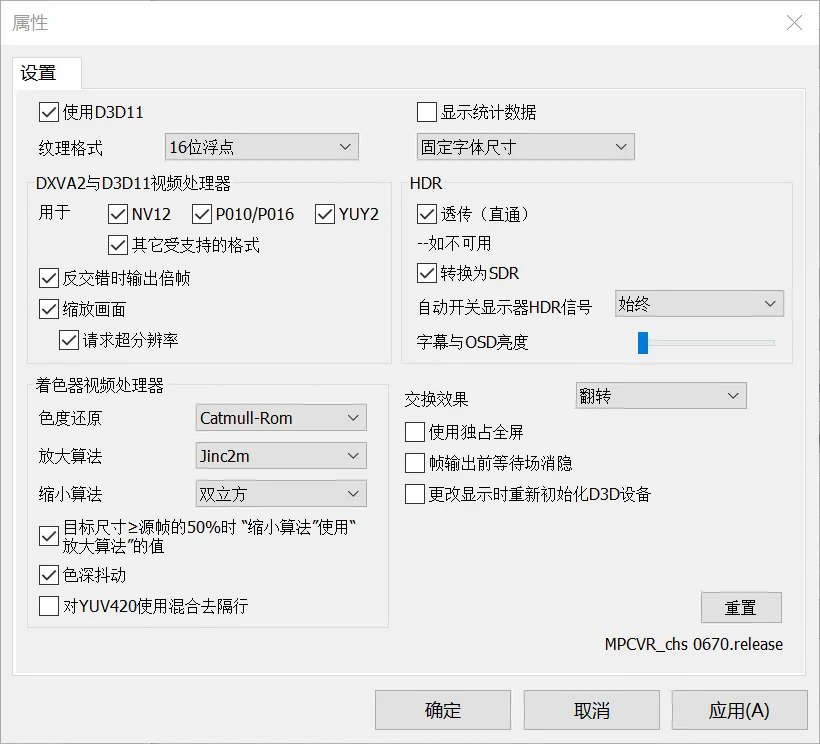
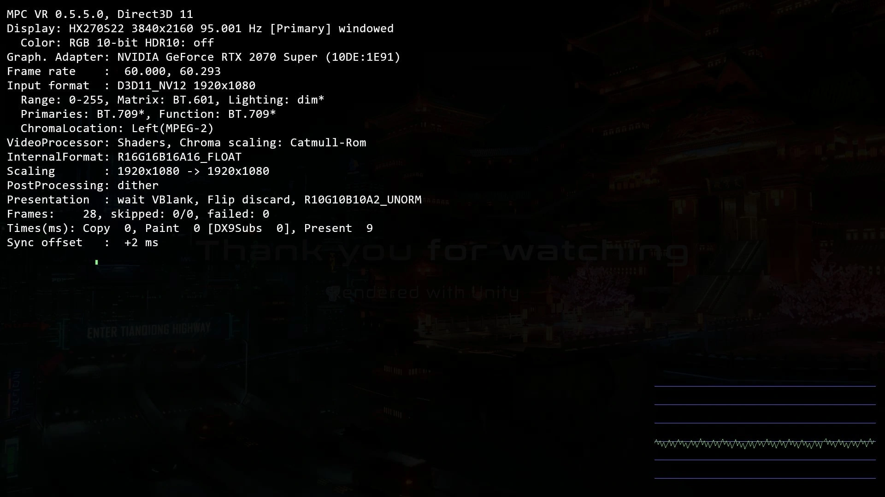

# MPCVR_chs

MPC-BE/HC 的可选视频渲染器之一  
该repo仅为汉化，与上游无功能差异

## 下载

见右侧 [Releases](https://github.com/hooke007/MPCVR_chs/releases)

## 使用

_可参考 [此处](https://hooke007.github.io/DirectShow+/mpc.html#142-mpc-video-renderer)_

**安装** —— 解压压缩包内文件到自定义文件夹（路径最好是纯英文数字），（右键管理员）运行 `Install_MPCVR_64.cmd` 即可注册，此后不要移动/更改这些文件。  
**更新** —— 只需替换对应文件即可，无需二次执行 `Install_MPCVR_64.cmd` 。也可选择运行一次 `Reset_Settings.cmd` 恢复初始设置。  
**卸载** —— （右键管理员）手动运行完毕 `Uninstall_MPCVR_64.cmd` 后删除自定义目录下的文件即可。

## 交流

见右上方网址，如果论坛无法进入可以到 [此处](https://github.com/hooke007/MPV_lazy/discussions) 发帖。

### MPC-BE
==========  
支持从播放器选项页面直接进入mpcvr的设置页（点击“属性”）；或者从载入文件后右键的滤镜列表中进入  

### MPC-HC
==========  
只能从载入文件后右键的滤镜列表中进入mpcvr的设置页  

## 说明

_该部分参考了官方说明 [出处](https://mpc-be.org/forum/index.php?topic=381.0)_

- **使用D3D11**

视频渲染器将尽可能使用Direct3D 11，而不是Direct3D 9。需要Windows 7 SP1，建议Windows 8.1或更高版本。

- **纹理格式**

用于存储中间处理结果的纹理格式。

PS：16位浮点格式增加了视频内存消耗。

- **显示统计数据** （见下图）  

在帧上方将绘制具有不同信息的统计数据。建议您打开它，以便在出现任何问题时进行屏幕截图。

————DXVA2 和 D3D11 视频处理器————

用于：NV12、P010/P016、YUY2、其他支持格式

指定在可能的情况下使用DXVA2或D3D11视频处理器的格式。DXVA2和D3D11视频处理器的工作速度通常比着色器快，并且能够进行硬件去隔行。

PS：隔行帧通常是NV12或YUY2格式。

- **反交错时输出倍帧**

在去隔行操作中，输出帧率将加倍.

- **缩放画面（用于调节画面大小）**

DXVA2或D3D11视频处理器将用于调整帧大小。（ **请求超分辨率** 即支持NVIDIA RTX的视频增强-超分辨率）

————着色器视频处理器————

> 视频处理器只能二选一： dxva2/d3d11（优先级高） 与 着色器  
> 取消勾选上方的编码格式(NV12 P010...)即对这些格式使用“着色器视频处理器”

- **色度还原**

将色度半采样的YUV（例如常见的 422 420 ）转换到RGB的算法。

- **放大算法**

用于放大帧的插值算法。

- **缩小算法**

用于缩小帧的插值算法。

- **目标尺寸≥源帧的50%时 “缩小算法”使用与“放大算法”的值**

即只有当你的目标分辨率低于源的50%时（例如2160p → 720p）才会使用 **缩小算法** 中你设定的值。

- **色深抖动**

允许在最终将颜色深度从10/16位减少到8位时使用抖动。抖动可以改善色阶过渡的平滑度。在小型显示器上，效果很可能不明显。

————HDR————

- **透传**

允许将HDR视频元数据传输到显示屏。

要求：Windows 10；支持HDR10的显示器；支持HDMI 2.0B或DisplayPort 1.4的图形卡。

- **转换为SDR**

允许将HDR视频转换为SDR，并在普通显示器上进行良好显示。

- **自动开关显示器HDR信号**

自动将显示器切换到HDR模式。

要求类似于“透传”。

- **字幕与OSD亮度**

调节该值可改变输出hdr时字幕与屏显文字的亮度（不影响sdr）

————————

- **交换效果**

将帧映射到桌面的方法。通常情况下，“丢弃”模式更稳定，但“翻转”模式可能更快。

- **使用独占全屏**

可解决辅助显示屏上的非浮动播放问题。

- **帧输出前等待场消隐**

允许更精确地确定帧输出时间，可以提高播放的平滑度。通过此选项，SyncOffset图表可以更准确地显示输出帧的不均匀性。
