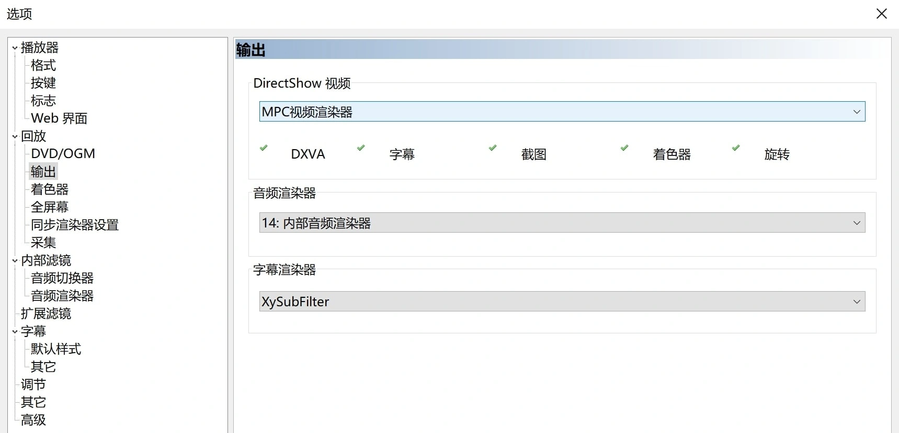

# MPCVR_chs

MPC-BE/HC 的可选视频渲染器之一  
该repo仅为汉化，与上游无功能差异

## 下载

见右侧 [Releases](https://github.com/hooke007/MPCVR_chs/releases)

## 使用

_可参考 [此处](https://hooke007.github.io/DirectShow+/mpc.html#142-mpc-video-renderer)_

**安装** —— 解压压缩包内文件到自定义文件夹（路径最好是纯英文数字），（右键管理员）运行 `Install_MPCVR_64.cmd` 即可注册，此后不要移动/更改这些文件。  
**更新** —— 只需替换对应文件即可，无需二次执行 `Install_MPCVR_64.cmd` 。也可选择运行一次 `Reset_Settings.cmd` 恢复初始设置。  
**卸载** —— （右键管理员）手动运行完毕 `Uninstall_MPCVR_64.cmd` 后删除自定义目录下的文件即可。

### MPC-BE
==========  
支持从播放器选项页面直接进入mpcvr的设置页（点击“属性”）；或者从载入文件后右键的滤镜列表中进入  

### MPC-HC
==========  
只能从载入文件后右键的滤镜列表中进入mpcvr的设置页  

## 说明

下图为我个人推荐的高质量设置  

_该部分为官方说明翻译 [出处](https://mpc-be.org/forum/index.php?topic=381.0)_

**使用D3D11**

视频渲染器将尽可能使用Direct3D 11，而不是Direct3D 9。需要Windows 7 SP1，建议Windows 8.1或更高版本。

**纹理格式**

用于存储中间处理结果的纹理格式。

PS：16位浮点格式增加了视频内存消耗。

**显示统计数据** （见下图）  

在帧上方将绘制具有不同信息的统计数据。建议您打开它，以便在出现任何问题时进行屏幕截图。

————DXVA2 和 D3D11 视频处理器————

用于：NV12、P010/P016、YUY2、其他支持格式

指定在可能的情况下使用DXVA2或D3D11视频处理器的格式。DXVA2和D3D11视频处理器的工作速度通常比着色器快，并且能够进行硬件去隔行。

PS：隔行帧通常是NV12或YUY2格式。

**去隔行时加倍输出帧率**

在去隔行操作中，输出帧率将加倍.

**用于调节画面大小**

DXVA2或D3D11视频处理器将用于调整帧大小。

————着色器视频处理器————

**色度拉伸**

将颜色分量从4:2:0和4:2:2增加到4:4:4的算法。

**放大算法**

一种用于放大帧的插值算法。

**缩小算法**

一种卷积算法，用于减少帧。

**帧尺寸≥源50%时 使用与“放大算法”相同的算法进行缩小**

插值算法也将用于将帧减少到50%。

**使用抖动**

允许在最终将颜色深度从10/16位减少到8位时使用衍射。衍射可以改善平滑过渡的映射.在小型显示器上，效果很可能不明显。

————HDR————

**透传**

允许将HDR视频元数据传输到显示屏。

要求：Windows 10；支持HDR10的显示器；支持HDMI 2.0B或DisplayPort 1.4的图形卡。

**转换为SDR**

允许将HDR视频转换为SDR，并在普通显示器上正确显示。

**自动显示HDR开/关**

自动将显示器切换到HDR模式。

要求类似于“透传”。

————————

**swap effect**

将帧映射到桌面的方法。通常情况下，Discard模式更稳定，但Flip模式可能更快。

**使用独占全屏**

可解决辅助显示屏上的非浮动播放问题。

**帧输出前等待VBlank**

允许更精确地确定帧输出时间，可以提高播放的平滑度。通过此选项，SyncOffset图表可以更准确地显示输出帧的不均匀性。
